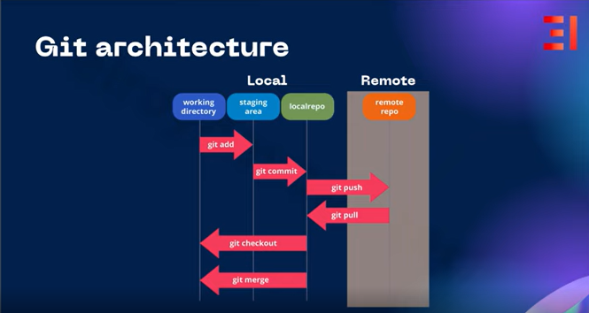

---
sidebar_position: 2
id: git_versioncontrol
title: Git, Version Control - Công cụ quản lý phiên bản dự án

---

# Git, Version Control trong Coding

Trong phần này, chúng ta sẽ tìm hiểu **Git** - một công cụ mà lập trình viên nào cũng phải biết cách dùng khi coding, cách sử dụng, ưu điểm cùng với ứng dụng của Git.


## Git là gì?

Git là một hệ thống quản lý phiên bản phân tán, giúp theo dõi các thay đổi trong tệp tin máy tính.

Hiểu đơn giản: Git sẽ theo dõi các tệp tin trong một dự án, quan sát xem file nào đã tạo/ thay đổi/ xóa trong môi trường mà chúng quản lý.

## Ưu điểm của Git trong dự án

1. Git cho phép nhiều lập trình viên làm việc cùng một dự án mà không cần kết nối mạng chung.
1. Git cho phép lập trình viên có thể làm việc offline trên repository cục bộ, sau đó đồng bộ với các kho lưu trữ (remote repository) từ xa như GitHub, Gitbucket hoặc GitLab khi có internet.
1. Git lưu trữ lịch sử thay đổi dưới dạng các snapshot, cho phép quy về các phiên bản trước khi cần thiết.(Cho trường hợp backup, v.v.)


## Cách sử dụng Git (các câu lệnh Git phổ biến)

Trong phần này, tôi chỉ hướng dẫn cách sử dụng Git đối với 1 project sử dụng GitHub. Tuy nhiên, trong thực tế người ta sẽ hay sử dụng GitLab cho việc commit, push cũng như là pull code vì GitLab có thể cấu hình nội bộ được và có tính bảo mật cao, phù hợp với môi trường Production/Enterprise. Tôi sẽ hướng dẫn bạn cách set up GitLab trên server ảo ở series DevSecOps sau.

Trước tiên, chúng ta sẽ phải hiểu Git workflow trước để có thể hiểu thêm các lệnh cơ bản về Git

### Git Workflow



Với Git, ta chia thành 2 môi trường chính:
- **Môi trường Local**: Là môi trường cá nhân của lập trình viên, nơi mà lập trình viên thực hiện thay đổi, chỉnh sửa code và các file liên quan.
- **Môi trường remote**: Là các kho lưu trữ ngoài ví dụ như **GitHub, GitLab** v.v. Các môi trường này sẽ thường được sử dụng để demo (GitHub) hoặc chạy production/enterprise (GitLab).


### Các câu lệnh cơ bản với Git
- ` git init`: Tạo 1 repository mới.
- ` git add`: Thêm tệp hoặc thư mục vào khu vực staging. Có các tùy chọn như ` .`( Thêm toàn bộ file) hoặc lựa chọn các file để thêm vào staging.
- ` git commit`:  Lưu snapshot của các thay đổi trong môi trường staging vào repository cục bộ. Có tùy chọn ` m` để thêm thông tin (description) vào commit trực tiếp.
- ` git rm --cached`: Loại bỏ tệp khỏi staging mà không xóa tệp khỏi thư mục làm việc
- ` git push`: Đẩy commit từ local repository lên remote repository. Có các tùy chọn như:
  - ` origin [tên nhánh]`: Đẩy commit lên một nhánh bất kỳ.
- ` git branch`: Kiểm tra các nhánh mà người dùng đang đứng. Có các tùy chọn như:
  - ` -a`: Tất cả các nhánh hiện có từ local repository đến remote.
- ` git checkout [tên nhánh]`: Người dùng chuyển sang một nhánh khác. Tùy chọn:
  - ` -b [tên nhánh]`: Nếu nhánh đó chưa tồn tại, thực hiện tạo nhánh và chuyển người dùng sang nhánh đó.
- ` git merge [nhánh cần hợp] [nhánh hợp]`: Hợp nhất code của các nhánh
- ` git pull`: Cập nhật thay đổi ở local repository trên remote repository.
- ` git clone <url>`: Tải toàn bộ remote repository về local repository

### Quản lý tệp và .gitignore
Trong trường hợp ta có nhiều file, thư mục mà không muốn cho vào môi trường staging, local repository hoặc hơn nữa là không muốn push lên remote, chẳng lẽ người dùng phải thực hiện ` git rm --cached` mỗi khi thực hiện push hoặc add code. Vì thế, ` .gitignore` ra đời như là một cách để có thể tự dộng loại bỏ file, thư mục đó.

**Cách config .gitignore trong 1 dự án**

- Bước 1: Tìm thư mục root trong dự án (chọn thư mục root là để file .gitignore có thể khai báo và lược bỏ nhiều file nhất có thể)
- Bước 2: Setup file .gitignore (tùy vào mỗi loại ngôn ngữ có 1 cách config khác nhau). Ví dụ với project .NET Core

``` jsx title="./.gitignore"
## Visual Studio 
[Bb]in/
[Oo]bj/
Generated\ Files/
TestResults/
*.suo
*.user
*.userosscache
*.sln.docstates

## Visual Studio Code
.vscode/
!.vscode/settings.json
!.vscode/tasks.json
!.vscode/launch.json
!.vscode/extensions.json
*.code-workspace

## JetBrains Rider
.idea/
*.sln.iml

## User-specific files
*.rsuser
*.suo
*.user
*.userosscache
*.sln.docstates

## Build results
[Dd]ebug/
[Dd]ebugPublic/
[Rr]elease/
[Rr]eleases/
x64/
x86/
[Aa][Rr][Mm]/
[Aa][Rr][Mm]64/
bbin/
obj/
external/

## NuGet Packages
*.nupkg
# Các gói thư viện sẽ được khôi phục tự động qua lệnh dotnet restore
**/packages/*
!**/packages/build/

## Publish output
publish/
*.[Pp]ublish.xml
*.azurePubxml

## Tránh lưu các file cấu hình chứa thông tin nhạy cảm (Secrets)
# Nếu bạn dùng Secret Manager thì không cần lo lắng, 
# nhưng nếu dùng file json cho môi trường local thì nên cân nhắc bỏ qua:
appsettings.Development.json
UserSecretsId

## Hệ điều hành
.DS_Store
Thumbs.db

## Log files
*.log
```

