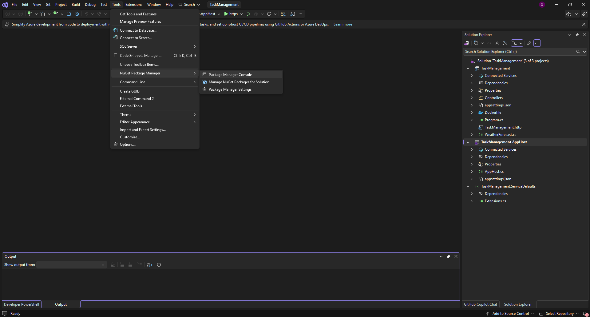
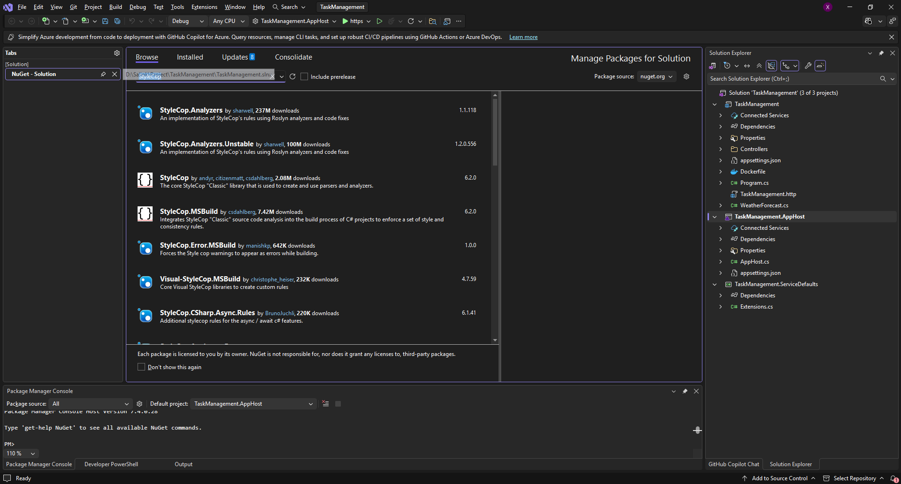
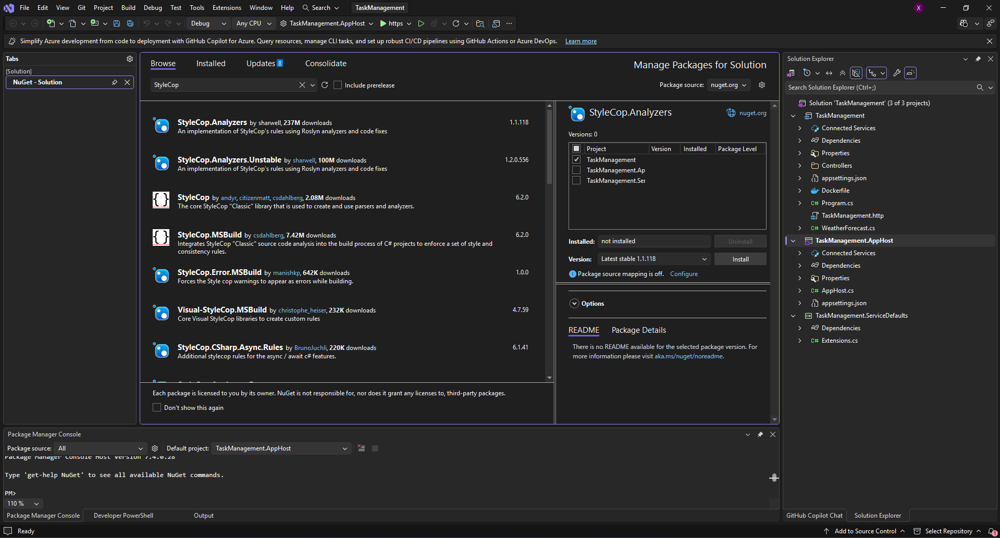
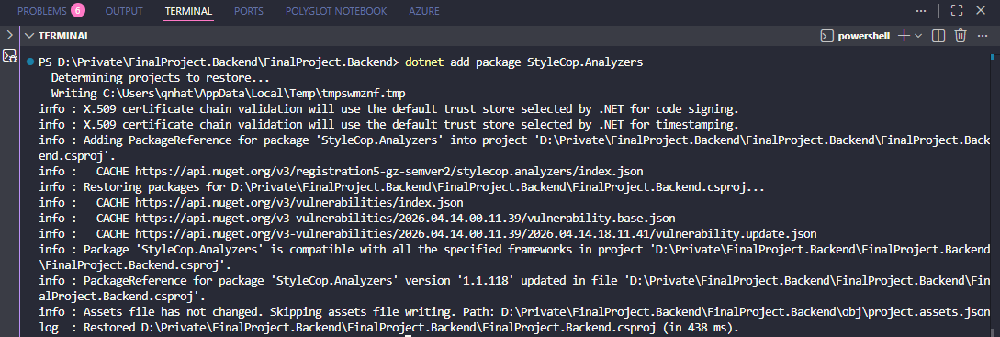

---
sidebar_position: 1
id: stylecop
title: StyleCop - Công cụ giúp lập trình viên tuân thủ Name Coding Convention

---

# SytleCop trong project C# ASP.NET

Trong phần này, tôi sẽ mô tả công cụ **SytleCop**, cách sử dụng, ưu điểm và nhược điểm cùng với ứng dụng của StyleCop:


## SytleCop là gì?

- SyleCop là một công cụ thường được sử dụng trong project C# (ASP.NET, .NET Core) giúp chuẩn hóa và duy trì phong cách code(Giống như Name Coding Convention).
- Công cụ này giúp tạo ra chuẩn thống nhất cho nhóm phát triển, dễ dàng bảo trì và nâng cao chất lượng code.

## Cách cài đặt và cấu hình StyleCop trong dự án .NET

Trong phần này, tôi sẽ hướng dẫn cách cài đặt SytleCop và cấu hình với chúng trong dự án C#( Cách cài đặt cho người dùng đang sử dụng Visual Studio 2026 và Visual Studio Code).

**Yêu cầu người dùng (Preconditions):**
- Đã tải Visual Studio và cài các package cho project .NET (đối với người dùng code bằng Visual Studio)
- Đối với Visual Studio Code: Yêu cầu người dùng đã tải dotnet CLI (dùng cho việc tạo project và thao tác) cũng như các extension phục vụ cho dự án .NET(Sẽ có hướng dẫn cụ thể sau).

Với phiên bản mà tôi đang thực hiện với hướng dẫn, tôi sử dụng project ASP.NET Core 8 Web API + .NET Aspire

### Cách cài đặt (Đối với người dùng Visual Studio)

- Bước 1: Vào Tools/Nuget Package Manager/Manage Packages for Solution



- Bước 2: Tại Nuget - Solution, chọn tab Browse và nhập ` StyleCop.Analyzers`. Tại đây, Nuget - Solution sẽ hiện gói packages này.



- Bước 3: Chọn Package ` StyleCop.Analyzers` và chọn **Install** (Lưu ý chọn phiên bản phù hợp với project).



(Ngoài ra, có thể cài đặt thông qua Package Manage Console bằng lệnh ` Install-Package StyleCop.Analyzers`)

### Cách cài đặt (Đối với người dùng Visual Studio Code)

Với người dùng sử dụng Visual Studio Code có sử dụng .NET CLI, chỉ cần sử dụng lệnh ` dotnet add package StyleCop.Analyzers`.



### Cấu hình StyleCop trong dự án .NET

Với StyleCop, người dùng cần tạo file ` stylecop.json` trong thư mục root của dự án để cấu hình code.


```jsx title="./stylecop.json"
{
  "settings": {
    "documentationRules": {
      // Có bắt buộc comment cho public không
      "documentExposedElements": true,

      // Có bắt buộc comment cho internal không
      "documentInternalElements": false,

      // Có bắt buộc comment cho private không
      "documentPrivateElements": false,

      // Interface có cần comment không
      "documentInterfaces": true
    },

    "orderingRules": {
      // using phải nằm ngoài namespace (chuẩn phổ biến)
      "usingDirectivesPlacement": "outsideNamespace",

      // System.* luôn đứng trên cùng
      "systemUsingDirectivesFirst": true
    },

    "layoutRules": {
      // File phải có newline ở cuối
      "newlineAtEndOfFile": "require"
    },

    "namingRules": {
      // Không cho phép Hungarian notation (strName, iCount...)
      "allowCommonHungarianPrefixes": false,

      // Cho phép prefix cho field (private _field)
      "allowedPrefixes": [ "_" ],

      // Method async phải có hậu tố Async
      "allowedSuffixes": [ "Async" ]
    },

    "readabilityRules": {
      // Cho phép dùng int thay vì Int32
      "allowBuiltInTypeAliases": true,

      // Cho phép dùng var
      "allowVar": true
    },

    "maintainabilityRules": {
      // Chỉ cho phép các loại top-level này
      "topLevelTypes": [
        "class",
        "interface",
        "enum",
        "struct"
      ]
    },

    "spacingRules": {
      // Không bỏ qua space trong cast (giữ strict)
      "ignoreSpacesInCast": false
    }
  }
}
```

Ngoài việc phải tạo file ` stylecop.json`, người dùng cần phải config trong ` .editorconfig` (thường được ở trong thư mục root của solution hoặc project).

```jsx title="./stylecop.json"
root = true

[*.cs]

########################################
# 🔥 DOCUMENTATION RULES
########################################

# Bắt buộc comment cho public
dotnet_diagnostic.SA1600.severity = warning

# Cho phép thiếu comment parameter
dotnet_diagnostic.SA1611.severity = none

########################################
# 🔥 NAMING RULES
########################################

# Class phải PascalCase
dotnet_diagnostic.SA1300.severity = error

# Field phải có _
dotnet_diagnostic.SA1309.severity = warning

########################################
# 🔥 ORDERING RULES
########################################

# using phải đúng vị trí
dotnet_diagnostic.SA1200.severity = warning

# System using phải đứng đầu
dotnet_diagnostic.SA1208.severity = warning

########################################
# 🔥 READABILITY RULES
########################################

# Không dùng this nếu không cần
dotnet_diagnostic.SA1101.severity = warning

# Không viết code khó đọc
dotnet_diagnostic.SA1110.severity = warning

########################################
# 🔥 FORMATTING RULES
########################################

# Không có khoảng trắng thừa
dotnet_diagnostic.SA1028.severity = warning

# Phải có newline cuối file
dotnet_diagnostic.SA1518.severity = warning

########################################
# 🔥 MAINTAINABILITY RULES
########################################

# Không để nhiều class trong 1 file
dotnet_diagnostic.SA1402.severity = warning

########################################
# 🔥 STRICT MODE (OPTIONAL)
########################################

# Uncomment nếu muốn build fail khi có warning
# dotnet_analyzer_diagnostic.severity = error
```

## Tính năng nổi bật của StyleCop
- Tự động sửa lỗi Name Coding Convention: Tự động  sắp xếp các namespace, thêm comment header chuẩn, chỉnh sửa spacing, dấu phẩy,...
- Kiểm tra và cảnh báo lỗi Name Coding Convention: Cảnh báo các lỗi vi phạm quy tắc code để lập trình viên dễ dàng nhận biết và sửa chữa.
- Có thể cài đặt extension SytleCop trực tiếp trong Visual Studio (bằng UI hoặc Manage Package Console) hoặc trong Visual Studio Code (dotnet CLI) và cho phép chạy kiểm tra trong từng file dễ dàng.

## Ứng dụng của StyleCop trên thực tế

1. Tích hợp StyleCop trong quy trình CI/CD: StyleCop có thể được tích hợp vào kiểm thử (CI). Ví dụ: Mỗi lần commmit code, SytleCop sẽ tự động chạy và compliance
1. Giúp cho việc code sạch, không bị lỗi Coding Name Convention.

## StyleCop sẽ được sử dụng trong trường hợp nào?

1. Trong một nhóm lớn có nhiều thành viên.
1. Trong dự án Production/Enterprise.
1. Cần kiểm tra chất lượng code theo một quy định nhất định.
1. Cần 1 công cụ review code có thể tích hợp với quy trình CI/CD.
1. Cần công cụ để training Intern.
1. Cần công cụ để xây dựng coding standard.

## Trường hợp nào sẽ không cần sử dụng StyleCop

1. Dự án nhỏ/ demo.
1. Dự án có vòng đời ngắn, yêu cầu ngắn về thời gian.
